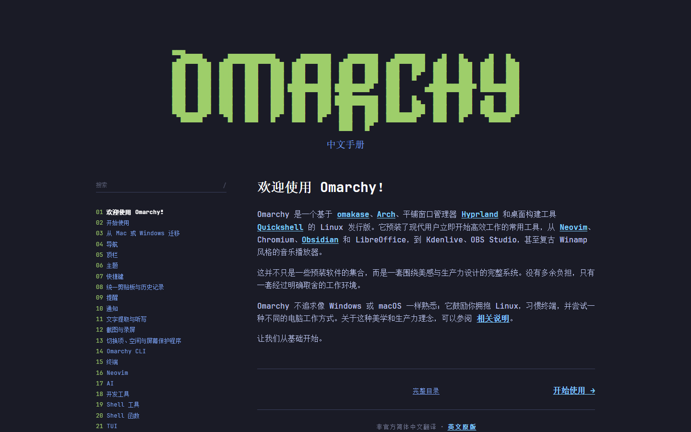

# Omarchy 中文手册

这是 [Omarchy 官方手册](https://omarchy.org/manual/)的非官方简体中文本地化站点。它完整覆盖目录页和 51 个章节，保留官方命令、快捷键、配置、代码块、链接、图片和终端视觉。



## 当前基线

- 上游仓库：[`basecamp/omarchy`](https://github.com/basecamp/omarchy)
- 上游分支：`quattro`
- 固定提交：`0ae1694830b6bd9511042fe1b89a0062d8c083cb`
- 页面：51 个章节页面 + 1 个完整目录页
- 图片：44 张手册 WebP + 38 张主题 PNG
- 代码块：39 个，逐块与上游进行文本比对
- 路由：与官方 `/manual/` 路径保持一致

本项目不代表 Omarchy 官方，也不构成官方背书。Omarchy、其标志和第三方产品名称属于各自权利人。

## 功能

- 完整中文目录和 51 个中文章节
- 桌面端粘性左侧章节导航及当前章节状态
- 中文标题和正文全文搜索，按 `/` 快速聚焦
- 搜索结果键盘选择、Escape 关闭及直接跳转
- 上一章、完整目录、下一章导航
- 中文标题锚点及官方英文深链接兼容别名
- 代码高亮、表格、引用、图片与横向代码滚动
- 与官方相同的 64em 桌面/移动响应式断点
- 本地字体和图片，不依赖官方站点热链

## 本地运行

需要 Node.js 20 或更高版本。

```bash
npm ci
npm test
npm run build
npm run check
npm run dev
```

浏览器打开：<http://127.0.0.1:4173/manual/>

`npm run build` 会重新生成 `site/`。`npm run check` 会检查所有生成页面、内部路由、标题锚点、图片、翻译标记、英文漏译以及与上游的代码/图片/链接一致性。

## 内容数据流

```text
upstream/manual/*.md ─┐
                     ├─ 结构与技术内容一致性检查 ─┐
translations/*.md ───┘                            │
                                                  ├─ Node 静态生成器 ── site/manual/**/index.html
upstream/manual/images/*.webp ────────────────────┤
upstream/themes/*/preview*.png ───────────────────┤
assets/css + assets/js + assets/fonts ────────────┘
```

构建过程不会自动访问网络，也不会静默更新上游。这样可以保证一次发布中的原文、译文和资源始终对应同一个提交。

## 翻译边界

会翻译：

- 页面标题、章节标题和说明性正文
- 目录、搜索、翻页和非官方声明
- 表格中的说明文字和图片替代文本

保持原样：

- Omarchy、Arch Linux、Hyprland、Quickshell、Neovim 等产品名称
- TUI、GUI、CLI、API、SSH、VM 等专业缩写
- 命令、参数、快捷键、文件路径、环境变量和配置键值
- 代码块、URL、图片文件与设备型号

统一术语位于 `translations/glossary.json`。

## 项目结构

```text
assets/                 本地 CSS、搜索脚本和 JetBrains Mono 字体
docs/plans/             已确认的设计和实施计划
evidence/source/        官方站桌面/移动视觉证据
evidence/implementation 本地实现浏览器截图
evidence/comparisons/   同尺寸源站/实现并排对比
src/                    内容、路由、渲染、搜索、构建和校验模块
test/                   Node 测试套件
translations/           51 篇中文译文和术语表
upstream/               固定提交的官方原文、图片与许可证
design-qa.md            响应式和视觉验收报告
```

## 更新上游

上游更新必须显式进行：

1. 获取 `basecamp/omarchy` 的目标 `quattro` 提交。
2. 替换 `upstream/manual/`、被引用主题图片和 `upstream/COMMIT`。
3. 逐章更新 `translations/`，不得直接覆盖中文译文。
4. 运行 `npm test && npm run build && npm run check`。
5. 重新执行桌面端和 390×844 移动端浏览器验收，并更新 `design-qa.md`。

## 许可证与来源

本项目原创生成器、测试和交互代码采用 [MIT License](LICENSE)。官方手册内容和图片保留在 `upstream/` 中，并附带其原始 MIT 许可证。JetBrains Mono 使用 SIL Open Font License 1.1。第三方译文参考、视觉样式和不属于本项目的品牌资产不自动包含在本项目 MIT 授权范围内，详细说明见 [NOTICE.md](NOTICE.md)。

